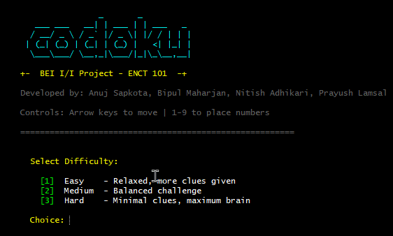
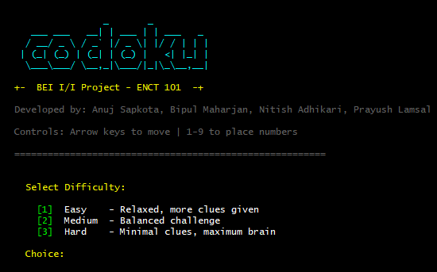
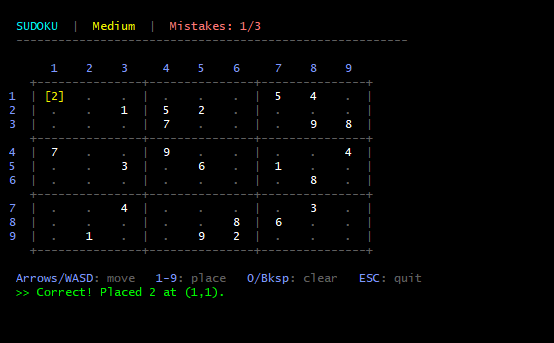
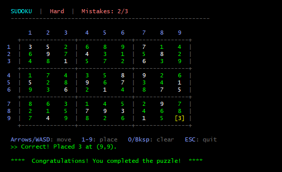

# Codoku 🧮

A terminal based Sudoku game for Windows built in C.  
**BEI I / I Project — ENCT 101**



---

## Team

- Anuj Sapkota  
- Bipul Maharjan  
- Nitish Adhikari  
- Prayush Lamsal  

---

## Features

- Three difficulty levels — Easy, Medium, Hard
- Color coded board using Windows console colors
- Mistake tracking (max 3 mistakes before game over)
- Solution reveal on game over
- Play again without restarting the program

---






---

## Requirements

- Windows OS
- GCC or any C compiler (e.g. MinGW)
- Puzzle files: `easy.txt`, `med.txt`, `hard.txt` in the `data/` folder
- Solution file: `sol.txt` in the `data/` folder containing pre-solved solutions

---

## How to Compile

```bash
gcc sudoku.c -o sudoku.exe
```

## How to Run

```bash
./sudoku.exe
```

---

## Controls

| Key | Action |
|-----|--------|
| Arrow keys / WASD | Move cursor |
| 1 – 9 | Place a number |
| 0 / Backspace | Clear a cell |
| ESC | Quit |

---


## Puzzle File Format

Each line in the `.txt` files is one puzzle:  81 digits in a row, left to right, top to bottom.  
`0` means an empty cell.

**Example puzzle string:**
```
003020600900305001001806400008500007000000000700009200005607000600108007007040100
```

**Parsed into the sudoku board:**
```
. . 3 | . 2 . | 6 . .
9 . . | 3 . 5 | . . 1
. . 1 | 8 . 6 | 4 . .
------+-------+------
. . 8 | 5 . . | . . 7
. . . | . . . | . . .
7 . . | . . 9 | 2 . .
------+-------+------
. . 5 | 6 . 7 | . . .
6 . . | 1 . 8 | . . 7
. . 7 | . 4 . | 1 . .
```

(`.` represents empty cells, which are `0` in the file)


---

## Limitations

- **Pre-solved Solutions**: The game uses solved solutions stored in `sol.txt` rather than solving puzzles algorithmically. This was implemented to avoid performance issues with complex puzzles (especially hard difficulty levels).

---

## Future Improvement

- The backtracking algorithm can be integrated in future versions for dynamic solution generation. This would eliminate the need for `sol.txt`.

---

## Project Structure

```
sudoku.c           — main source file
data/
  easy.txt         — easy puzzles
  med.txt          — medium puzzles
  hard.txt         — hard puzzles
  sol.txt          — solutions (organized by [EASY], [MED], [HARD] sections)
README.md          — this file
```